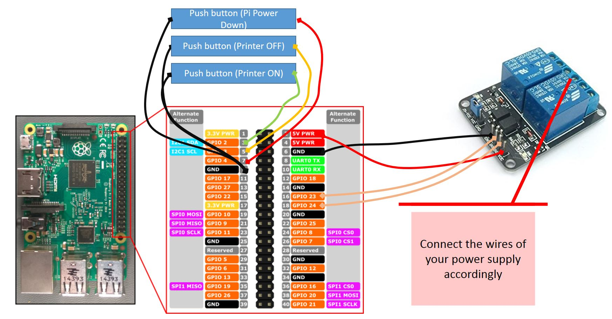

# Power-relay-for-octoprint-with-manual-buttons
## Tutorial to install a power relay with manual push buttons to a octoprint raspberry
## ***DISCLAIMER:*** **This tutorial is showing a how to re-wire your power supply. You will be handling with high currency, which might cause danger to your life, so following the tutorial is completely at your own risk!**

### Preparations:
**Material list:**
-   Raspberry Pi with octoprint istalled
-   Raspberry power supply (e.g. https://www.amazon.com/NorthPada-Raspberry-Supply-Charger-Adapter/dp/B01N336XEU/ref=sr_1_4?crid=1QB0DAFPFPW5O&keywords=raspberry+power+supply&qid=1553617351&s=gateway&sprefix=raspberry+power%2Caps%2C267&sr=8-4)
-	2 channel relay 5V (e.g. https://www.amazon.com/Qunqi-Channel-Optocoupler-Expansion-Raspberry/dp/B078478SZ9/ref=sr_1_17?crid=CXURI6C091ZR&keywords=5v+relay&qid=1553608726&s=gateway&sprefix=5v+rel%2Caps%2C247&sr=8-17)
-	3 push buttons (if possible with different colour) (e.g. https://www.amazon.com/URBEST-Momentary-Button-Switch-Pieces/dp/B01IU898QA/ref=sr_1_14?crid=2TF6BJU8SI5MC&keywords=button+electronic&qid=1553608797&s=gateway&sprefix=button+ele%2Caps%2C408&sr=8-14)
-	Some female to female jumper wires (e.g. https://www.amazon.com/GenBasic-Solderless-Dupont-Compatible-Breadboard-Prototyping/dp/B01L5ULRUA/ref=sr_1_3?crid=1GVJ0KXXOGT7X&keywords=female+female+jumper+wires&qid=1553616573&s=gateway&sprefix=female+femal+jum%2Caps%2C266&sr=8-3) 
-	AC high voltage power cable depending on your county you have to choose the right diameter
-	Some wire terminals to ensure proper connections for the AC high voltage cabling (e.g. https://www.amazon.com/Glarks-Disconnect-Electrical-Solderless-Connectors/dp/B01E4RAVI0/ref=sr_1_8?keywords=wire+terminals&qid=1553608962&s=gateway&sr=8-8)
-	Electrical tape and/or shrinking tube

*OPTIONAL*: 
If you decide to connect your raspberry to the printers power cord.
-	RS-25-5 power supply (e.g. https://www.amazon.com/MEAN-WELL-Switching-Resistance-Temperature/dp/B07BHQKNP1/ref=sr_1_1?keywords=rs+25-5&qid=1553617484&s=gateway&sr=8-1)
-	Micro USB cable

**Tool list:**
-	Head screwdriver
-	Soldering kit
-	Side cutter
-	Wire stripper
-	Knife (might also replace side cutter and wire stripper
-	Crimping tool
-	Heat gun or blow torch (if you use shrinking tube)

### Hardware Assembly:
The following picture shows the wiring of the relay and the push buttons with the GPIO of the pi:

The connection of the relay to the power cables depend you your specific setup. It is supposed to close the circuit when you activate the relay and open the circuit when you deactivate relay (or power-off the raspberry)

**OPTIONAL:**
Separate RS-25-5 power supply 

[RS-25-5 schematics](https://media.it-tronics.de/Datasheets/Power_Supplies/MeanWell/RS-25.pdf)
If you choose the optional setup with a separate RS-25-5 power supply allowing to use only the standard power cord of your printer, you need to connect the RS-25-5 to the power socket. (I am using the main power switch to power up the RS-25-5 which boots up the raspberry)

Use a mirco USB power cable

or a standard micro-USB cable, clip off the USB plug end and wire the lines accordingly to the RA-25-5 5V end.

and check the output current with a multimeter and tune at the RS-25-5 if required

### Preparing the ocptoprint raspberry software
#### Installing python and  RPI.GPIO library (if requried)
`pi@raspberrypi ~ $ sudo apt-get update`
`pi@raspberrypi ~ $ sudo apt-get install python-dev`
`pi@raspberrypi ~ $ sudo apt-get install python-rpi.gpio`
OPTIONAL: If you want to play around with the GPIO it is a good idea to install [wiringpi](http://wiringpi.com/the-gpio-utility/)

#### Copy script to raspberry
SSH into the octoprint raspberry main directory `pi@octopi:~ $ `
Create scripts directory `mkdir scripts`
Copy the [scripts](https://github.com/caesar1111/Power-relay-for-octoprint-with-manual-buttons/tree/master/scripts) into the scripts folder using e.g WinSCP
Edit the [rc.local](https://www.raspberrypi.org/documentation/linux/usage/rc-local.md)file to add the python scripts for the push buttons `sudo nano /etc/rc.local`
enter before "exit 0" line
`# Starting power button python scripts`
`sudo python /home/pi/scripts/buttonon.py &`
`sudo python /home/pi/scripts/buttonoff.py &`
`sudo python /home/pi/scripts/buttonshutdown.py &`
Save the rc.local file [Ctrl+x] > `y` > [Enter]
Reboot the the pi.

#### Checking scripts
Check the bash scripts
`bash /home/pi/scripts/poweron.sh`
`bash /home/pi/scripts/lighton.sh`
`bash /home/pi/scripts/poweroff.sh`
`bash /home/pi/scripts/lightoff.sh`
Check the python scripts by pressing the push buttons
GPIO2 => runs `poweron.sh` and `lighton.sh`
GPIO3 => runs `poweroff.sh` and `ligtoff.sh`
GPIO4 => runs `sudo shutdown now` shutting down the octoprint raspberry (always good to do it befor cutting the power)

### Configuring optoprint
Install the plug-in [system command editor](https://plugins.octoprint.org/plugins/systemcommandeditor/)
`pip install "https://github.com/Salandora/OctoPrint-SystemCommandEditor/archive/master.zip"`
Follow the instructions on the on plugins.octoprint.org : [https://plugins.octoprint.org/plugins/systemcommandeditor/](https://plugins.octoprint.org/plugins/systemcommandeditor/)
Now you can configure the octoprint buttons according your requirements, e.g. a "all ON" button running the command `https://plugins.octoprint.org/plugins/systemcommandeditor/`

This tutorial is inspired by: https://www.thingiverse.com/thing:1428478 and https://wiki.fablab-muenchen.de/pages/viewpage.action?pageId=29950175

If you find some errors or have any questions please contact me on thingiverse https://www.thingiverse.com/caesar_1111 or on discord caesar_1111#2840

